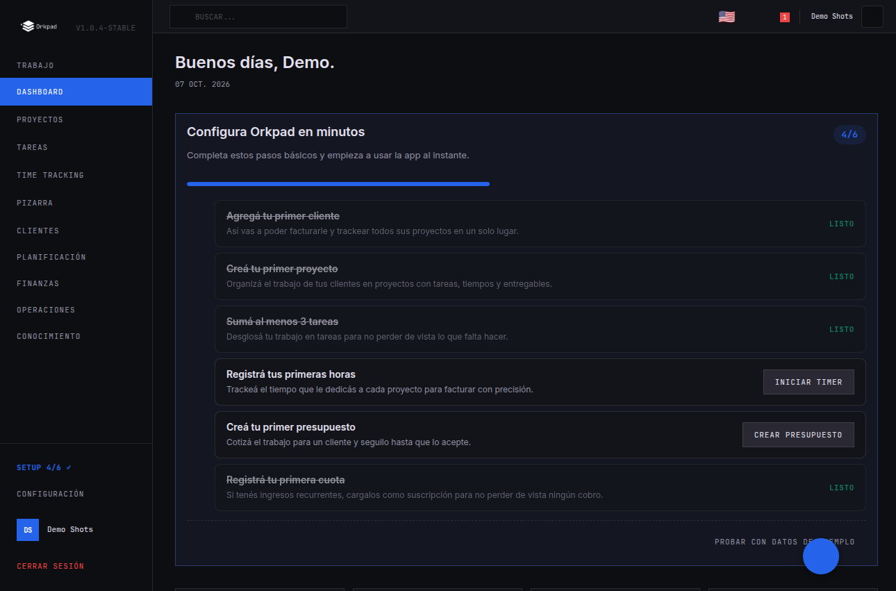
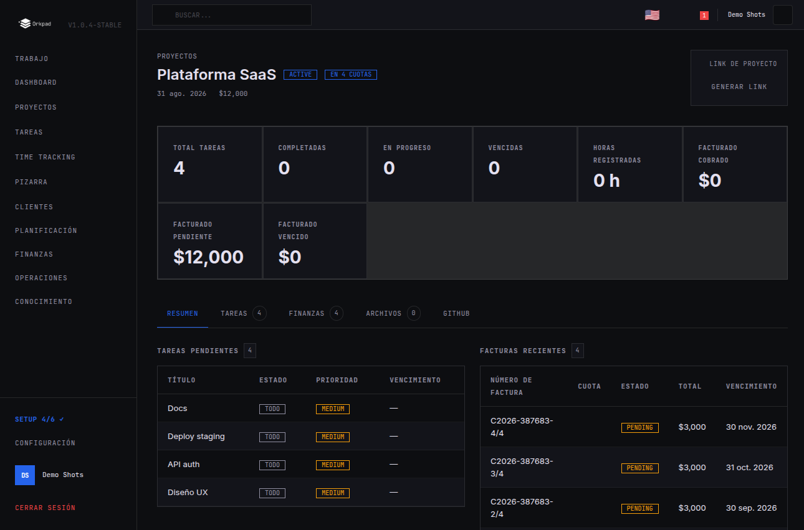

# Orkpad

[](https://github.com/ignaciobecher/orkpad/actions/workflows/ci.yml)
[](./LICENSE)


**Orkpad** is an open-source app for freelancers and small agencies. It replaces the broken Excel, the outdated Notion, and the scattered WhatsApp reminders. CRM, projects, time tracking, and billing — in one self-hostable place, under your control.

This is a **monorepo** with two applications:

| Directory  | Description                                         | Stack |
| ---------- | --------------------------------------------------- | ----- |
| `frontend/` | Web app (dashboard, PWA)               | Vue 3, Vite, Vuetify, Tailwind, Pinia, vue-i18n |
| `backend/`  | Multi-tenant REST + realtime API                    | NestJS, MongoDB (Mongoose), Socket.IO, JWT |

- **Multi-tenant**: each workspace is isolated; data never leaks between workspaces.
- **Self-hostable**: run it on your own infrastructure.
- **Local AI assistant**: chat with your data using self-hosted Ollama models (RAG over notes, docs, tasks, projects and invoices). See [docs/AI_SETUP.md](./docs/AI_SETUP.md).
- **License**: [Apache-2.0](./LICENSE).

## Screenshots

| Onboarding checklist | Project detail with billing plan |
|---|---|
|  |  |

## Requirements

- [Docker](https://docs.docker.com/get-docker/) + [Docker Compose](https://docs.docker.com/compose/install/) (included with Docker Desktop)
- [Git](https://git-scm.com/downloads)

That's it. Node.js, MongoDB, and everything else runs inside Docker containers. No accounts, no API keys, no external services required.

## Clone & Run with Docker

### 1. Clone the repository

```bash
git clone https://github.com/ignaciobecher/orkpad.git
cd orkpad
```

### 2. Create the environment file

```bash
cp .env.example .env
```

Open `.env` in any text editor. The **only values you must change** are the two JWT secrets — replace them with long random strings (generate with `openssl rand -base64 48`):

```env
JWT_SECRET=replace-this-with-a-long-random-string-at-least-16-chars
JWT_REFRESH_SECRET=replace-this-with-another-long-random-string-16+
```

Everything else works out of the box for local usage:

- MongoDB runs in its own container — no setup needed.
- `FRONTEND_URL` / `VITE_API_URL` / `API_URL` default to `localhost`.
- Email (`RESEND_API_KEY`) and GitHub OAuth are optional — leave them commented out.

### 3. Start the stack

```bash
docker compose up --build
```

This builds and starts **three containers**:

| Service | What it does | URL |
|---------|-------------|-----|
| `mongo` | MongoDB 7 database | — (internal) |
| `backend` | NestJS API + Swagger docs | http://localhost:3000 |
| `frontend` | Vue 3 SPA served via nginx | http://localhost:8080 |

The first run takes a few minutes (downloading images, installing deps, building). Subsequent starts are fast.

### 4. Open the app

- **Frontend**: [http://localhost:8080](http://localhost:8080)
- **Backend API docs**: [http://localhost:3000/api](http://localhost:3000/api)

The root URL redirects to **registration**. Create your account with email + password and start using Orkpad — no email server, no GitHub login, nothing else required.

> **Note:** email verification is skipped when `RESEND_API_KEY` is not set, so your first account works immediately. If you later configure Resend, new accounts will verify by email as usual.

### 5. Your first 5 minutes

After registering you'll land on the **dashboard** with a welcome tour and a setup checklist:

1. **Take the tour** — a quick walkthrough of every section (clients, projects, invoicing, time tracking, finance, messaging), or skip it.
2. **Follow the checklist** — 6 steps that take you exactly where you need to go, with the creation form opening automatically where it matters:
   - Add your first client
   - Create your first project
   - Add at least 3 tasks
   - Log your first hours
   - Create your first quote
   - Register your first retainer (cuota)
3. **Try demo data** — the last tour slide and the dashboard checklist both offer one-click sample data (a demo client, project, tasks, quote, and retainer) so you can explore with realistic content. Remove it anytime from the dashboard checklist.

Every empty list (clients, projects, quotes, retainers, invoices) also guides you with a direct creation button. Completing steps shows a progress bar (`Setup n/6`) in the sidebar and fires celebratory toasts as you go. The checklist hides itself once everything is done, and the built-in help (`/help`) documents every module.

### 6. Stop the stack

Press `Ctrl+C` in the terminal where Docker is running, or run:

```bash
docker compose down
```

Your data persists in a Docker volume (`orkpad_mongo_data`). To wipe everything and start fresh:

```bash
docker compose down -v
```

### Development without Docker

If you prefer to run without Docker, you need:

- Node.js `^20.19.0` or `>=22.12.0`
- A MongoDB instance (local, Docker, or a cloud cluster like [MongoDB Atlas](https://www.mongodb.com/atlas))

> Local ports `3001` / `8081`: if ports `3000` / `8080` are taken on your machine, copy `docker-compose.override.yml.example` to `docker-compose.override.yml` (git-ignored) and adjust the ports there.

### Backend

```bash
cd backend
npm install
cp .env.example .env        # fill in JWT_SECRET and JWT_REFRESH_SECRET
npm run start:dev           # API + Swagger on http://localhost:3000
```

### Frontend

```bash
cd frontend
npm install
cp .env.example .env        # VITE_API_URL points to the backend
npm run dev                 # app on http://localhost:5173
```

## Environment Variables

### Required

The app won't start without these:

| Variable | Description | Example |
|----------|-------------|---------|
| `MONGODB_URI` | MongoDB connection string | `mongodb://localhost:27017/orkpad` |
| `FRONTEND_URL` | Origin of the frontend app (used for CORS, emails, auth redirects) | `http://localhost:8080` |
| `JWT_SECRET` | Secret for signing access tokens (min 16 chars) | any long random string |
| `JWT_REFRESH_SECRET` | Secret for signing refresh tokens (min 16 chars) | any long random string |

### Optional

Everything else has sensible defaults or can be left empty to disable:

| Variable | Default | Purpose |
|----------|---------|---------|
| `PORT` | `3000` | HTTP port the API listens on |
| `NODE_ENV` | `development` | Runtime mode (`development` / `test` / `production`) |
| `JWT_EXPIRES_IN` | `15m` | Access token lifetime |
| `JWT_REFRESH_EXPIRES_IN` | `7d` | Refresh token lifetime |
| `API_URL` | `http://localhost:3000` | Public base URL of the API (for email links) |
| `FROM_EMAIL` | `no-reply@orkpad.com` | Sender address for outgoing emails |

### Optional services

Leave empty to disable. Configure only if you need the feature:

| Service | Env vars | Purpose |
|---------|----------|---------|
| GitHub OAuth | `GITHUB_CLIENT_ID`, `GITHUB_CLIENT_SECRET`, `GITHUB_CALLBACK_URL` | Link GitHub repos to projects (login/register is always email + password) |
| Resend | `RESEND_API_KEY` | Transactional emails (verification, password reset). When empty, new accounts verify instantly |
| Web Push | `VAPID_PUBLIC_KEY`, `VAPID_PRIVATE_KEY` | Browser push notifications |

## Deploy to production

### Docker (VPS / self-hosted server)

1. Clone the repo on your server and create `.env`:

   ```bash
   git clone https://github.com/ignaciobecher/orkpad.git
   cd orkpad
   cp .env.example .env
   ```

2. Edit `.env` with production values:
   - Set real random strings for `JWT_SECRET` and `JWT_REFRESH_SECRET` (`openssl rand -base64 48`)
   - Set `FRONTEND_URL` to your public app URL (e.g. `https://app.yourdomain.com`)
   - Set `VITE_API_URL` and `API_URL` to your public API URL (e.g. `https://api.yourdomain.com`)
   - Optional: `RESEND_API_KEY` for emails, `GITHUB_*` for repo linking

   > **Important:** `VITE_API_URL` is baked into the frontend at build time — set it **before** running `docker compose up --build`. If you change it later, rebuild the frontend (`docker compose up -d --build frontend`).

3. Start the stack:

   ```bash
   docker compose up -d --build
   ```

4. Put a reverse proxy in front to handle HTTPS. Example with Caddy:

   ```
   app.yourdomain.com {
       reverse_proxy localhost:8080
   }
   api.yourdomain.com {
       reverse_proxy localhost:3000
   }
   ```

5. Open `https://app.yourdomain.com` — you'll land on registration. Create your account and you're in. Back up the `orkpad_mongo_data` Docker volume regularly.

### Railway / Render / Fly.io

- Point the service to the `backend/` directory
- Set the required env vars in the platform's dashboard
- MongoDB: use [MongoDB Atlas](https://www.mongodb.com/atlas) (free tier available) or a managed MongoDB service

### Netlify (frontend only)

The `frontend/` directory includes a `netlify.toml` with SPA redirect rules. Deploy the frontend to Netlify and point `VITE_API_URL` to your backend URL.

## Repository layout

```
orkpad/
  frontend/   # Vue 3 web application
  backend/    # NestJS API
```

Each application has its own `README.md`, `.env.example`, and conventions. See [`frontend/README.md`](frontend/README.md) and [`backend/README.md`](backend/README.md). Changes are tracked in [`CHANGELOG.md`](CHANGELOG.md).

## Contributing

Contributions are welcome! Read [`CONTRIBUTING.md`](CONTRIBUTING.md) to get started, and please follow our [`CODE_OF_CONDUCT.md`](CODE_OF_CONDUCT.md).

Found a security issue? Do **not** open a public issue — report it via the [Security Advisories](https://github.com/ignaciobecher/orkpad/security/advisories) page. See [`SECURITY.md`](SECURITY.md).

## License

Licensed under the [Apache License, Version 2.0](./LICENSE). Copyright 2026 Orkpad contributors.
